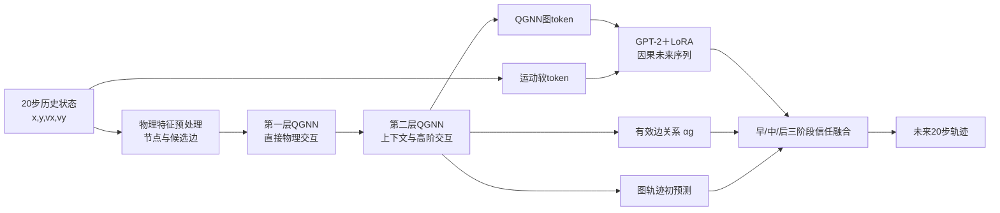

# ICCT会议论文：QGNN＋LLM多目标轨迹预测完整研究归档

更新时间：2026-09-10  
目标会议：ICCT  
当前状态：单训练种子开发与既有测试验证已完成，主方案冻结；仍需多种子与新的独立确认数据。

## 1. 研究目标与问题演化

论文的核心目标始终是验证：**量子图神经网络（QGNN）与大语言模型（LLM）能否形成有意义的协同结构，并提高多目标轨迹预测性能。**

最初采用“经典GNN＋量子适配器＋LLM”。该路线中，量子模块只对经典图特征做小残差修正，量子ADE改善约0.14%，匹配经典适配器约0.52%。这与早期“Graph＋LLM相对Target GNN改善约4%–6%”并不矛盾：前者测量的是量子适配器在另一套固定量子子集/多SNR协议中的边际贡献，后者测量的是早期完整Graph＋LLM相对Target GNN的总体贡献，数据划分、分母、模型和训练协议均不同。

适配器路线无法证明QGNN的独立价值，因此研究转向：用量子关系核替换图消息传递核心，让QGNN直接承担“目标之间怎样交互”的建模职责；LLM承担“交互影响怎样随未来时间演化”的时序推理职责。后续所有主要实验都围绕这两个职责展开。

## 2. 任务、数据和评价

### 2.1 任务

输入为每个目标20步历史状态：

\[
(x,y,v_x,v_y),
\]

输出默认是未来20步二维位置，即2秒轨迹。另有一组40步、4秒长预测诊断。

### 2.2 噪声协议

主要QGNN实验在5、10、15、20 dB四档SNR下评估，报告四档宏平均ADE和FDE。固定训练种子为2026。

### 2.3 数据使用边界

- 早期经典Graph＋LLM、最终1200场景测试、后续991场景开发接口研究及4秒实验不是同一协议，不能直接混算。
- 后续接口实验只用固定开发选择集选择epoch，没有再次用测试集调参。
- 既有测试集在项目历史中已经查看过，不能表述为从未查看的全新盲测。
- 当前bootstrap衡量固定单种子模型在场景/时间块重采样下的不确定性，不能替代多训练种子。

## 3. 当前主方案总体结构

当前冻结主方案为：**物理对齐双层QGNN＋图条件化future-token GPT-2/LoRA＋有效关系三阶段信任门。**

## 4. 为什么采用两层QGNN

第一层负责一跳直接交互：相对距离、相对速度、闭合趋势和冲突风险。它以物理边特征为主，用较小的上下文增益，减少尚未整理好的高维隐藏状态对量子核的干扰。

第二层接收第一层更新后的节点表示，负责高阶交互。例如A影响B、B再影响C时，第二层允许A间接感知C带来的群体变化。第二层更重视经过第一层汇聚后的上下文关系。

使用两层不是因为“量子层越多越好”，而是多目标图上至少需要两次消息传播才能表达邻居的邻居。旧版双层QGNN曾明显失败（0.692303/1.345202），根因是两层没有明确分工、高维特征任意压缩到少量角度、重复量子变换叠加信息损失。新版通过物理特征前置、分层职责和中性残差初始化，将双层QGNN恢复到0.675118/1.303763。

## 5. PennyLane量子关系核

### 5.1 为什么是6个量子比特

每条候选边整理为12个有物理意义的关系量：7个有界物理边特征、4个发送端/接收端分组节点相关量、1个节点隐藏特征RMS差。每个量子比特可用RY和RZ两个旋转角承载两类信息，因此6个量子比特正好编码12个关系量。

6比特也是表达力与解析模拟成本之间的折中。状态向量维度为\(2^6=64\)，可以在RTX 4090上反向传播；继续增加比特会指数增加状态模拟成本，但当前数据并没有证据说明更多比特会产生更高泛化性能。

### 5.2 角度编码

最终物理对齐版本对每个输入先学习缩放和平移，再映射为：

\[
\theta_k=2\arctan(s_kx_k+0.25\tanh b_k),
\]

使角度限制在\((-\pi,\pi)\)。小输入附近近似线性，极端值自动饱和，避免异常距离或速度产生无限旋转角。早期曾使用`LayerNorm → Linear(263→6) → π·tanh`把高维边向量压成6个角度；该做法过度压缩且物理含义不清，已被物理对齐12维编码替代。

### 5.3 电路结构

后端为PennyLane 0.31.1 `default.qubit`，`shots=None`解析态矢量模拟。每个量子核使用6比特、3层：

1. RY/RZ写入当前边数据；
2. 每比特执行可训练RZ–RY–RZ旋转；
3. 环形CNOT执行\(q_0\to q_1,q_1\to q_2,\ldots,q_5\to q_0\)；
4. 下一层重新写入输入，即数据重上传。

数据编码把经典关系写入量子态；可训练旋转调整决策边界；CNOT让一个关系通道的状态影响其他通道；数据重上传使低比特电路形成更复杂的非线性函数。每层量子核54个可训练参数。

### 5.4 测量、注意力与门控

电路测量6个单比特\(Z_i\)和6个相邻双比特\(Z_iZ_{i+1}\)，得到12维量子关系表示。两个经典线性读出生成多头注意力和消息门控：

\[
m_{ij}=\alpha_{ij}g_{ij}v_{ij}.
\]

- \(\alpha_{ij}\)：决定当前目标关注哪个邻居；
- \(g_{ij}\in(0,2)\)：决定该边消息通过多少；
- \(v_{ij}\)：128维经典消息内容。

量子电路不直接生成整条轨迹，而是负责判断关系的重要性和通行强度。高维内容继续走经典value路径，避免让6个量子比特承担不现实的高维生成任务。

### 5.5 严格经典对照

匹配经典核采用`12→2→12`低秩SiLU MLP，每层60个参数；量子核每层54个参数。完整双层图模型总参数只差12个，其余输入、批次、训练日程、选择规则和网络结构一致。

## 6. 运动token、图token和LLM

### 6.1 运动token如何形成

历史位置和速度不是先写成自然语言。运动tokenizer根据局部速度、方向和位移计算441类离散运动词的软概率分布，再对运动词嵌入表做加权和。这样得到连续、可微的运动软token；概率分布保留不确定性，梯度可以从轨迹损失返回tokenizer和投影层。

### 6.2 图token如何形成

双层QGNN输出每个目标的节点表示。节点表示经LayerNorm和线性投影映射到GPT-2嵌入维度，形成连续图token。图token包含目标自身状态及邻居交互汇聚结果，因此它是QGNN与LLM的主要接口。

### 6.3 LLM实际接收什么

LLM同时接收历史运动软token和QGNN图token。future-token版本还把20个未来位置放入GPT-2的因果序列，每个未来隐藏状态只能看到历史和更早的未来状态。GPT-2输出441类运动词概率，可微软解码为逐时刻坐标，再与QGNN粗轨迹通过零初始化门融合。

LLM输入是连续`inputs_embeds`，不是自然语言字符串。GPT-2主要提供因果序列建模能力，LoRA只微调少量注意力参数。

### 6.4 当前最有效的QGNN–LLM耦合

最终接口使用QGNN真实消息强度\(\alpha g\)聚合不同目标的LLM未来隐藏状态，并学习早、中、后三阶段信任倍率。典型倍率约1.04/1.07/1.09，表明LLM修正在中后期使用得更多。

最新组件消融显示，去掉未来分支图token后几乎完全退回旧QGNN＋LLM起点，而去运动token只有很小退化、去可学习future query几乎不变。因此当前证据支持的核心衔接是：**QGNN图表示条件化LLM未来推理。**

## 7. 实验结果总览

### 7.1 早期经典Graph＋LLM

原始完整协议中，Target GNN为0.6202/1.2529，Graph＋LLM为0.5925/1.1956，改善4.47% ADE和4.57% FDE。多SNR下相对Target GNN改善约4.03%–5.64% ADE、3.95%–5.80% FDE。

### 7.2 双层QGNN最终测试

| 模型 | ADE (m) | FDE (m) |
|---|---:|---:|
| Plain GNN | 0.667081 | 1.287700 |
| 双层经典GNN | 0.647470 | 1.248408 |
| 双层QGNN | 0.650250 | 1.259475 |
| 双层经典GNN＋LLM | **0.641379** | **1.243187** |
| 双层QGNN＋LLM | 0.644688 | 1.253012 |

QGNN＋LLM相对Plain GNN改善3.357%/2.694%，bootstrap 95% CI均为正；但相对匹配经典GNN＋LLM差0.516%/0.788%。

### 7.3 当前开发集贡献链

| 模型 | ADE (m) | FDE (m) |
|---|---:|---:|
| Plain GNN | 0.685107 | 1.328154 |
| 纯QGNN | 0.675118 | 1.303763 |
| 旧QGNN＋LLM | 0.671203 | 1.299919 |
| future-token QGNN＋LLM | 0.670060 | 1.296719 |
| **有效关系三阶段QGNN＋LLM** | **0.669766** | **1.296094** |
| 匹配经典图＋LLM | 0.667706 | 1.296894 |

当前主方案相对Plain GNN改善2.239%/2.414%，相对纯QGNN改善0.793%/0.588%。总体上经典方案ADE更好0.309%，量子方案FDE好0.062%，不能证明总体量子优势。

### 7.4 高交互场景

| 场景 | 量子相对匹配经典ADE | FDE |
|---|---:|---:|
| 全部场景 | −0.309% | +0.062% |
| 综合复杂度最高20% | −0.006% | +0.787% |
| 综合复杂度最高10% | +0.682% | +1.382% |
| 闭合强度最高10% | +1.106% | +1.397% |
| 机动强度最高10% | +0.415% | +1.356% |

量子优势随交互复杂度增强，但约100个困难场景上的量子对经典置信区间仍跨0。当前可以报告趋势，不能报告统计显著的普适量子优势。

### 7.5 LLM组件消融

| 未来分支 | ADE (m) | FDE (m) |
|---|---:|---:|
| 完整 | **0.670060** | 1.296719 |
| 去运动token | 0.670210 | 1.297370 |
| 去QGNN图token | 0.671172 | 1.299832 |
| 去可学习future query | 0.670081 | **1.296586** |

去图token的退化为0.1658%/0.2395%，时间块bootstrap区间均不跨0；去运动token和去future query的区间跨0。图token是目前证据最强的耦合组件。

### 7.6 量子电路机制消融

| 变体 | ADE (m) | FDE (m) |
|---|---:|---:|
| 去纠缠 | 0.753977 | 1.474782 |
| 仅1层电路 | 0.741027 | 1.437262 |
| 去数据重上传 | 0.744333 | 1.456635 |
| 编码范围0.5π | 0.680496 | 1.315573 |

这些结果支持纠缠、三层深度、数据重上传和较完整的角度范围在当前量子核内部有用，但不能单独证明量子优于经典。

### 7.7 4秒预测

纯QGNN为1.423014/3.246469，QGNN＋LLM为1.421641/3.243777，只改善0.097%/0.083%。单纯延长时域没有扩大LLM优势。

### 7.8 量测航迹关联图

12种条件平均下，量子关联GNN为F1 0.998466、RMSE 0.530669 m；同预算经典/MLP均为F1 0.998529、RMSE 0.529942 m。量子相对匹配经典差0.137% RMSE，未证明量子关联优势。

完整原始表见`docs/source_archives`中的全部实验结果汇总和各阶段报告。

## 8. 已尝试路线及决策

### 8.1 量子适配器

量子只作为成熟经典GNN后的残差适配器，提升约0.14%，经典适配器约0.52%。结论：量子模块职责太弱，不能支撑QGNN贡献，停止。

### 8.2 单层QGNN

单层PennyLane QGNN为0.676327/1.309241，与单层匹配经典0.676196/1.308717近乎持平。结论：单层只能处理直接邻居关系，高阶交互不足。

### 8.3 旧双层全量子

旧双层量子退化至0.692303/1.345202。结论：不是“两层量子必然失败”，而是任意压缩和重复量子变换造成信息瓶颈。由物理对齐双层方案替代。

### 8.4 量子高维value消息

量子0.677705/1.311409，经典0.675193/1.303526。结论：用低比特电路直接生成高维内容不合适，量子核只保留关系判断职责。

### 8.5 basis-mixing

从零训练时经典已退化至0.699142/1.362656；热启动量子前三轮未超过epoch 0。结论：变换增加优化难度，没有提供新信息，停止。

### 8.6 LLM阶段解冻QGNN

第5轮后退化。较大的LLM梯度扰乱已学好的量子关系核。最终采用冻结QGNN、只训练token投影、LoRA和修正头。

### 8.7 future-token

把未来查询真正放进GPT-2并将token概率可微解码，量子侧改善0.170%/0.246%。有效但属于通用LLM增强，经典侧也得到相近收益。

### 8.8 QGNN注意力路由LLM

总体ADE略退化、FDE微升；高复杂度组相对未路由模型改善0.052%/0.036%。结论：关系路由适用于高交互场景，但不应无条件用于全部场景。

### 8.9 有效关系\(\alpha g\)三阶段信任

相对future-token模型进一步改善0.044%/0.048%，成为当前冻结主方案。均匀路由略好于learned关系的独立确认结果说明当前仍未证明量子权重本身优于简单关系。

### 8.10 自由量子关系token和碰撞风险注意力

自由关系token注意力接近均匀，收益约0.015%；时间碰撞风险降低了注意力熵但没有扩大验证收益；原始12维量子测量与LLM隐藏状态直接融合连续6轮未超过epoch 0。结论：不能把原始量子数值当普通token直接交给LLM。

### 8.11 边级未来交互解码器

依次测试直接坐标边解码、未来相对位置监督和高交互风险专家，分别出现约0.097%/0.051%、0.008%/0.004%、0.004%/0.002%的退化。边级因果贡献没有直接标签，分解不可辨识，停止。

### 8.12 意图Token规划器

将未来划分早中后三段，预测纵向、横向和交互意图。准确率约60%–65%，但QGNN版本只改善0.0044%/0.0024%，真实意图oracle也只额外改善0.0009%。结论：粗粒度语义可预测，但没有新的坐标信息。

### 8.13 长时域

2秒扩至4秒后LLM增益降至0.097%/0.083%。结论：更长未来同时增加QGNN和LLM的不确定性，并不会给LLM增加新条件。

### 8.14 高复杂度定向微调和物理规则选择

定向微调测试0.645751/1.254935，未超过主检查点0.644688/1.253012；开发集选择的高机动规则在测试仅接近持平。结论：不能通过事后挑选困难样本制造主结果。

### 8.15 两跳稀疏交互探索

独立开发确认块曾得到约1.05% ADE、0.92% FDE量子改善，但不含LLM、没有最终测试且不是当前双层主模型，只能作为后续研究线索。

## 9. 为什么当前总体提升仍有限

1. 轨迹误差主要由目标自身运动解释，跨目标交互只占较小残差。
2. QGNN已经聚合邻居信息，LLM再次接收相同位置速度，新增信息高度重复。
3. 当前数据没有车道拓扑、信号灯、车辆类别和明确行为标签，LLM缺少可发挥知识与语义推理的外部条件。
4. 6比特量子核与低秩经典核容量都较小，当前样本规模下经典核足以拟合主要模式。
5. 困难交互样本比例低，全体ADE/FDE被大量易场景主导。
6. 当前量子使用解析态矢量模拟，没有硬件噪声、有限shots或运行加速证据。

## 10. 论文可用论点与证据边界

### 10.1 可以写

- 提出物理对齐双层QGNN＋LLM混合框架；
- QGNN量子关系核直接产生注意力和消息门控；
- QGNN图token显著影响LLM未来分支，说明二者存在可验证接口；
- 完整模型稳定优于Plain GNN和纯QGNN；
- 量子相对经典的点估计随交互复杂度增强；
- 纠缠、深度和数据重上传消融支持当前电路设计。

### 10.2 不能写

- QGNN已经在总体上显著优于匹配经典GNN；
- 当前结果证明普适量子优势或量子加速；
- PennyLane `default.qubit`等同于真实量子计算机；
- 单种子场景bootstrap等同于跨训练种子稳定性；
- 最高10%子组结果是预期外可任意推广的总体结论。

## 11. 投稿前优先补充

1. 当前最终主方案和匹配经典方案至少运行3–5个训练种子；
2. 在最终effective-relation架构上复现去图token和去future query消融；
3. 预先定义高交互条件，在新时间段或新数据集独立验证；
4. 增加碰撞率、最小间距误差、冲突目标FDE等关系敏感指标；
5. 加入有限shots和量子噪声模型实验，明确解析模拟与近硬件模拟差别；
6. 若数据允许，为LLM增加车道、信号灯、车辆类别或轨迹语义信息；
7. 保留匹配低秩MLP、较宽MLP和经典注意力核，避免将参数容量误认作量子贡献。

## 12. 代码和结果位置

- `code/01_classical_graph_llm`：早期Target GNN、运动token、GPT-2/LoRA、经典对比与消融；
- `code/02_pennylane_qgnn_core`：远端权威PennyLane量子核、双层物理模型、训练、评估、机制消融和统计；
- `code/03_qgnn_llm_interfaces`：future-token、注意力路由、有效关系信任、意图、长时域和LLM组件消融；
- `code/04_quantum_association`：量子量测航迹关联开发验证；
- `results/summaries`：关键实验的summary/protocol/smoke/bootstrap JSON副本；
- `docs/source_archives`：各阶段原始MD报告；
- 大型checkpoint、逐样本NPZ和原始数据仍保留在原工程及远端`/home/js_cn/sensing`，本归档不重复复制。

## 13. 当前一句话结论

当前工作已经证明QGNN＋LLM框架对Plain GNN和纯QGNN有稳定增益，并通过图token消融定位了QGNN条件化LLM未来推理的有效接口；量子相对匹配经典的优势主要出现在高闭合、高机动和高交互场景，但单种子总体证据尚不足以宣称显著量子优势。
