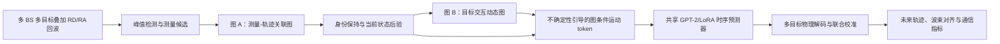

# 第二研究点评估与实施方案

## 面向多基站 ISAC 的不确定性感知双图多目标跟踪与轨迹预测

> 评估日期：2026-08-13  
> 依据：第一篇在投论文《Uncertainty-Guided Motion Tokenization for LLM-Based Trajectory Prediction in Multi-BS ISAC Systems》、当前《实验代码》工程，以及截至评估日期可检索到的相关工作。

## 1. 先给结论

这个方向**适合作为第二个研究点，综合推荐度约 8/10**，并且与第一点的承接关系很好：

- 第一点评价的是：多基站感知噪声下，怎样利用定位不确定性提高**单目标**长时轨迹预测的鲁棒性。
- 第二点可以评价的是：多目标共存时，怎样同时处理**观测关联、目标交互和预测不确定性**，得到身份连续、交互一致的多目标轨迹。

但题目不能只表述为“在原模型中加入 GNN，预测多个目标”。截至 2026 年，GNN 多目标轨迹预测、GNN 多目标跟踪、Graph+LLM 的 ISAC 应用都已有先行工作。单纯增加一个 GAT/GCN 层，创新性偏弱，也很容易被审稿人评价为模块堆叠。

建议将第二点收敛为：

> **研究多基站叠加回波下，利用不确定性感知的测量关联图和目标交互图，联合完成多目标身份保持、轨迹状态估计与未来轨迹预测；定位不确定度和关联不确定度共同控制运动 token 的软化程度。**

推荐的论文级方法名可暂定为：

> **UG-DGMT：Uncertainty-Guided Dual-Graph Motion Tokenization for Joint Multi-Target Tracking and Trajectory Prediction in Cooperative Multi-BS ISAC**

这比“GNN + 原有 LLM”更完整，也能把两篇工作串成一条明确的硕士论文主线：**从单目标的感知不确定性建模，扩展到多目标的关系与关联不确定性建模。**

---

## 2. 第一篇工作已经解决了什么

第一篇论文形成了以下流程：

1. 三个 BS 提取距离、Doppler 和角度特征；
2. 多 BS 后验融合得到粗位置、速度和定位不确定度；
3. 将全局运动转换到目标中心局部坐标系；
4. 用定位不确定度调节 soft motion token 的温度；
5. 通过 GPT-2/LoRA 预测未来运动 token；
6. 使用 GRU 残差物理解码与 1D-CNN 全局校准得到连续轨迹；
7. 用 ADE/FDE、预测辅助波束对齐和可达速率验证效果。

这项工作的核心贡献不是“用了 LLM”，而是把**感知后验不确定度显式传递到运动 token 表示**。第二点最好保留这条主线，不要换成一个与第一篇割裂的普通多智能体 GNN。

第一点与第二点的逻辑关系如下：

| 维度 | 第一研究点 | 建议的第二研究点 |
|---|---|---|
| 场景 | 单目标、多 BS | 多目标、多 BS、目标数量可变 |
| 主要困难 | 噪声导致定位误差和长时漂移 | 叠加回波、漏检/虚警、数据关联、ID 切换、目标交互 |
| 不确定性 | 单目标定位后验扩散度 | 定位不确定度 + 关联熵 + 交互不确定性 |
| 结构先验 | 时间序列 | 测量-轨迹二部图 + 目标交互动态图 + 时间序列 |
| 输出 | 一个目标的未来轨迹 | 多目标当前轨迹、身份及联合未来轨迹 |
| 通信价值 | 单波束预测对齐 | 多用户/多波束调度、和速率与失配概率 |

---

## 3. 对现有代码的关键审查结论

### 3.1 当前代码本质上仍是“多条独立单目标样本”

现有数据生成和训练流程不能直接声称多目标感知或多目标跟踪，理由很明确：

- `gen_lankershim_data_v2.py` 中的 `load_and_preprocess` 先按 `Vehicle_ID` 分组，再逐车独立插值；
- 每条轨迹被单独平移到 150 m × 150 m 区域，并加入独立随机位置抖动，原始车辆之间的共同时间轴和相对几何关系被破坏；
- `gen_one_file` 对每条轨迹逐一调用 `gen_bs_observations`，每个 RF 样本只包含一个目标；
- 当前 RD/RA 图由单目标距离、速度或角度向量做外积得到，不包含多个目标回波的物理叠加；
- `run_snr_sweep.py` 的样本索引是 `(traj_idx, start)`，`LocalizedWindowDataset` 每次只返回一个目标窗口；
- `motion_tokenizer_v7.py`、`TimeLLM_V7.py` 和 ADE/FDE 评估也都采用 `[batch, time, ...]` 的单目标组织方式。

因此，直接在模型输入外面增加一个 target 维度，并不能把当前实验变成真正的多目标 ISAC。最先需要改的是**数据组织和多目标回波生成**，其次才是 GNN。

### 3.2 原始 NGSIM 数据具备多目标研究基础

对文件夹中的 `Lankershim_Vehicle_Trajectories.csv` 做共时统计后得到：

- 约 160.7 万条记录、1506 辆车、20669 个全局时间戳；
- 整段道路每个时间戳的共时车辆数中位数约为 78；
- 只统计交叉口区域时，共时车辆数中位数约为 16，99% 分位约为 31，最大约为 38；
- 分别截取约 150 m 长的道路 ROI 时，不同区段的车辆数中位数约为 6～32。

这说明数据量足以构建多目标场景，但不宜一开始把所有车辆都送入 LLM。建议先限制每个场景最多 `M=8` 或 `M=12` 个交互最强的目标，并用 mask 支持目标出生、消失和数量变化。

### 3.3 当前数据划分也需要同步升级

现有生成器会对单车轨迹做旋转、镜像和合成，再打乱后封装进不同文件。如果一个原始轨迹的增强副本跨越训练集和测试集，可能产生场景或运动模式泄漏。

多目标版本应按 `Global_Time` 的连续区间或互不重叠的完整场景划分 train/val/test；所有来自同一时间段的窗口及其增强版本只能属于同一个 split。

---

## 4. 创新性判断：什么已经不够新

截至 2026-08-13，至少需要正视以下相关方向：

1. [MotionLM: Multi-Agent Motion Forecasting as Language Modeling（ICCV 2023）](https://openaccess.thecvf.com/content/ICCV2023/html/Seff_MotionLM_Multi-Agent_Motion_Forecasting_as_Language_Modeling_ICCV_2023_paper.html) 已经把多智能体连续轨迹离散为运动 token，并通过语言建模生成联合未来轨迹。因此，“多目标 + motion token + LM”本身不能作为主要新意。
2. [Multi-Target Tracking for Full-Duplex Distributed ISAC（Asilomar 2023）](https://doi.org/10.1109/IEEECONF59524.2023.10476975) 已使用 JPDA 与 EKF 在分布式 ISAC 中定位、关联和跟踪多个目标。因此，“多 BS ISAC 多目标跟踪”本身也不是空白。
3. [Temporal Graph Neural Network for ISAC Target Detection and Tracking（2026）](https://arxiv.org/abs/2604.08306) 已把 delay-Doppler 图建模为时序图，用 TGNN 完成多目标聚类、身份分类和跟踪。这与“用 GNN 做 ISAC 多目标跟踪”高度接近。
4. [Graph Learning for Cooperative Cell-Free ISAC Systems（IEEE TWC 2026）](https://doi.org/10.1109/TWC.2026.3674789) 已采用异构图和时空注意力进行多目标位置、速度估计及网络协同设计。
5. [Graph-Enhanced LLM for SWAN-ISAC（2026）](https://arxiv.org/abs/2604.10256) 已出现 Graph 表示接 LLM/LoRA 的 ISAC 方法，虽然任务是天线部署和波束赋形而不是轨迹预测，但意味着“Graph+LLM 用于 ISAC”也不能直接宣称首次提出。

由此得到三条“创新红线”：

- 不要把贡献写成“首次把 GNN 用于多目标 ISAC”；
- 不要把贡献写成“首次用 LLM 做多目标运动预测”；
- 不要只比较单目标 LSTM/TCN/Transformer，然后用 ADE/FDE 证明 GNN 有效。

真正有区分度的切入点应是：

> **多 BS 感知后验不确定度如何同时作用于跨站测量关联、目标交互建图和运动 token 生成，并进一步改善多目标跟踪、联合轨迹预测及预测辅助通信。**

在完成更系统的 IEEE/arXiv 文献检索前，不建议在论文中使用“first”类表述。

---

## 5. 推荐研究问题与三个可检验假设

### 研究问题

在多 BS 接收到多个车辆的叠加回波、且存在噪声、虚警、漏检和轨迹交叉时，如何维持目标身份、估计当前状态，并预测未来多目标联合轨迹？

### 假设 H1：不确定性感知关联优于仅靠欧氏距离关联

当两个目标交叉或低 SNR 导致定位后验扩散时，使用位置协方差、Doppler 一致性、BS 几何和轨迹先验构造图边，应比最近邻或固定距离门控产生更少的 ID switch。

### 假设 H2：交互图对拥挤/转弯场景有效，对稀疏直行场景增益有限

GNN 的价值应主要体现在跟驰、汇入、交叉口冲突和转弯场景。实验需要按目标密度、TTC 和转向类型分层，否则平均 ADE 可能掩盖真正贡献。

### 假设 H3：关联熵与定位不确定度联合控制 token 温度更稳健

第一点只用定位扩散度控制 token 温度。多目标场景还存在“这个观测究竟属于哪个目标”的不确定性。若把关联概率熵也写入温度，轨迹交叉或漏检阶段的 token 分布会更合理。

---

## 6. 推荐方法：不确定性感知双图框架

### 6.1 总体流程



建议保留两张图，而不是强行把所有实体塞进一张大图：

- **图 A 解决“是谁”**：跨 BS、跨帧测量与历史轨迹之间的数据关联；
- **图 B 解决“会怎么走”**：目标之间的交互和未来运动依赖。

这样的模块职责更清楚，也方便分别做消融和替换为传统基线。

### 6.2 多目标回波模型必须先改正确

当前单目标代码中，RD/RA 图可由一个目标的原子向量外积构造。多目标时不要先分别把所有距离向量和 Doppler 向量相加后再做一次外积，否则会引入大量非物理交叉项。应直接对每个目标的二维原子外积求和：

\[
\mathbf R_{b,t}=\sum_{i=1}^{M_t}\alpha_{b,i,t}
\mathbf a_r(r_{b,i,t})\mathbf a_v(v_{r,b,i,t})^{H}
+\mathbf C_{b,t}+\mathbf N_{b,t},
\]

\[
\mathbf A_{b,t}=\sum_{i=1}^{M_t}\alpha_{b,i,t}
\mathbf a_r(r_{b,i,t})\mathbf a_\theta(\theta_{b,i,t})^{H}
+\mathbf C'_{b,t}+\mathbf N'_{b,t}.
\]

其中 `M_t` 是当前目标数，`C` 表示静态杂波/虚警背景，`N` 表示噪声。随后在每个 BS 的 RD/RA 图上执行可控阈值的 CFAR 或局部峰值检测，生成候选测量，而不是直接把真值目标状态输入 GNN。

### 6.3 图 A：测量-轨迹关联图

图 A 可采用动态二部图或异构图：

- 测量节点：`[BS_ID, range, Doppler, angle, amplitude, peak width, posterior covariance, SNR]`；
- 轨迹节点：上一时刻的 `[position, velocity, heading, covariance, age, miss_count, hidden_state]`；
- 测量-轨迹边：马氏距离、径向速度残差、角度残差、BS 几何、时间间隔、可见性和置信度；
- 跨 BS 测量边：不同 BS 的候选测量是否能解释为同一个空间目标；
- 输出：关联 logits、未匹配/新生目标的 dustbin 概率、更新后的状态后验。

工程上可先用 GNN 输出代价矩阵，再通过 Hungarian 完成一一匹配；之后再尝试 Sinkhorn 或可微匹配。JPDA-EKF 和 gated Hungarian-EKF 必须作为强基线。

### 6.4 图 B：目标交互动态图

每个有效 track 是一个节点，节点特征建议包括：

`[x, y, vx, vy, heading, acceleration, covariance, track_confidence, association_entropy, history_token_embedding]`

边特征不要只用欧氏距离，应加入：

- 相对位置与相对速度；
- 纵向/横向间距；
- heading difference；
- time-to-collision（TTC）；
- lane/intersection/movement 信息；
- 两个目标位置后验的马氏距离或重叠度；
- 边存在的持续时间。

为控制复杂度，采用 uncertainty-aware radius graph 或 top-k 图，每个目标只连接交互最强的 `k=4～8` 个邻居。推荐先用 2 层 GATv2/Graph Transformer，不要一开始堆叠很深的 GNN。

### 6.5 从“定位不确定度”扩展为“定位 + 关联不确定度”

可将第一篇中的 token 温度扩展为：

\[
T_{i,t}=\operatorname{clip}\left(
T_{\rm base}+\alpha\bar u_{i,t}^{\gamma}
+\beta\bar H^{\rm assoc}_{i,t}
+\eta\bar H^{\rm graph}_{i,t},
T_{\min},T_{\max}\right),
\]

其中：

- `u`：目标定位后验扩散度；
- `H_assoc`：该目标测量关联概率的归一化熵；
- `H_graph`：目标交互边注意力的熵或邻域冲突度，可作为可选项。

再用此温度生成每个目标的软运动 token。这样第二点不是简单复用第一点，而是把 uncertainty guidance 推广到多目标关联与关系推理。

### 6.6 GNN 与 LLM 的连接方式

建议先采用较稳妥的方案：

1. 每个目标共享同一套 motion tokenizer 和 GPT-2/LoRA 参数；
2. 目标自身的 soft token embedding 与图 B 输出的交互上下文相加或门控融合；
3. 所有目标并行预测未来 token；
4. 用轻量 joint refinement 层对同一时刻的多目标预测做一致性校准。

这能保持 target permutation equivariance，目标数量变化也容易处理。若该方案跑通且时间充足，再升级为 MotionLM 风格的 scene-level 联合自回归序列，但必须处理目标排序、可变目标数和推理复杂度。

不要仅因为使用 GPT-2 就假设它天然理解交通交互。实验中必须加入“相同图编码器 + 小型 Transformer/GRU 解码器”作为参数量和训练预算相近的对照，证明预训练 LLM 确实有贡献。

### 6.7 推荐损失函数

完整版本可以使用：

\[
\mathcal L =
\lambda_{\rm det}\mathcal L_{\rm det}
+\lambda_{\rm assoc}\mathcal L_{\rm assoc}
+\lambda_{\rm state}\mathcal L_{\rm NLL}
+\lambda_{\rm tok}\mathcal L_{\rm token}
+\lambda_{\rm traj}\mathcal L_{\rm traj}
+\lambda_{\rm con}\mathcal L_{\rm consistency}.
\]

- `L_det`：峰值/候选目标检测；
- `L_assoc`：测量-轨迹关联与新生/漏检分类；
- `L_NLL`：当前状态及协方差的概率监督；
- `L_token`：未来运动 token 交叉熵或 KL；
- `L_traj`：连续轨迹 Smooth-L1/ADE 加权损失；
- `L_consistency`：碰撞、身份连续、速度/加速度和联合轨迹一致性。

训练时建议分阶段：先训练感知和关联，再训练预测，最后小学习率联合微调；不要一开始端到端训练全部模块。

---

## 7. 研究范围怎么控制

### Level 0：预验证版本，2～4 周

- 保留真实共时多车轨迹和 oracle track ID；
- 给每个目标独立生成带噪状态估计；
- 只验证目标交互图 + graph-conditioned motion token 是否优于独立预测。

用途：快速判断 GNN 是否对当前数据有效。  
限制：只能称为多目标/多智能体轨迹预测，不能称为完整多目标感知与跟踪论文。

### Level 1：推荐的论文版本，约 10～14 周

- 构造多目标叠加 RD/RA 回波；
- 使用 CFAR/峰值检测得到测量候选；
- 图 A 完成跨 BS、跨帧关联和轨迹状态更新；
- 图 B 完成交互建模；
- 使用不确定性引导 motion token + 共享 LLM 预测；
- 评价 tracking、forecasting 和 communication 三类指标。

这是创新性、工作量和毕业时间之间最合理的平衡，建议作为第二点的正式范围。

### Level 2：高风险扩展版本，4～6 个月以上

- 直接从原始多目标回波端到端检测、关联、跟踪和预测；
- 处理目标出生/死亡、长时间遮挡、未见目标和跨 BS handover；
- 联合优化波束/资源调度。

这个版本适合作为后续扩展，不建议现在把它设成唯一可交付目标。

---

## 8. 多目标数据集重构方案

### 8.1 场景级组织

新生成器应保留：

- `Vehicle_ID`；
- `Global_Time`；
- 原始 `Local_X/Local_Y` 或统一的场景坐标；
- `Lane_ID`、`Int_ID`、`Movement`；
- 同一时刻所有目标的相对几何关系。

按统一时间轴插值到 0.05 s 时，必须对整个场景共同插值，不再逐车重置时间起点。建议以交叉口或固定道路 ROI 构造 `T_hist=72`、`T_pred=20` 的场景窗口。

### 8.2 建议保存的数据结构

```text
scene_rf_rd:       [N_scene, T, B_bs, N_range, N_doppler, 2]
scene_rf_ra:       [N_scene, T, B_bs, N_range, N_angle, 2]
target_state:      [N_scene, T, M_max, state_dim]
target_mask:       [N_scene, T, M_max]
target_id:         [N_scene, T, M_max]
measurement_set:  ragged/list 或 padding 后的候选测量
association_gt:    [N_scene, T, M_track, M_measurement]
lane/movement:     [N_scene, T, M_max, meta_dim]
```

### 8.3 难度课程

建议按课程学习逐步增加难度：

1. 2～4 个目标，无漏检、无虚警；
2. 4～8 个目标，加入 RCS 波动和 AWGN；
3. 加入静态杂波、随机虚警和 5%～20% 漏检；
4. 加入轨迹交叉、并线、转弯和 BS dropout；
5. 扩展到 8～12 个目标及跨场景泛化。

---

## 9. 现有代码如何复用

| 当前文件 | 可复用内容 | 必须修改或新增的内容 |
|---|---|---|
| `dataset_feature_config.py` | BS 位置、距离/速度/角度维度配置 | 增加多目标、候选测量和场景 mask 配置 |
| `gen_lankershim_data_v2.py` | NGSIM 读取、运动学计算、Rician 衰落、BS 几何、雷达原子 | 新建场景级生成器；保留全局时间；多目标二维原子求和；杂波/漏检/虚警 |
| `structured_frontend.py` | 各模态编码、BS 几何编码与注意力融合 | 支持 measurement/track 节点；或作为候选测量特征编码器 |
| `motion_tokenizer_v7.py` | 目标中心坐标、forward/lateral codebook、soft/hard decode | 向量化 target 维；温度加入关联熵；支持 target mask |
| `TimeLLM_V7.py` | GPT-2/LoRA、token embedding、物理解码、anchor estimator | 接入 graph context；共享多目标预测；加入联合 refinement 和变长 mask |
| `run_snr_sweep.py` | 训练循环、缓存、SNR sweep、ADE/FDE 日志 | 换成 scene dataset；加入 association/tracking loss 和多目标评估 |
| 现有绘图与评估脚本 | 单目标轨迹图、SNR 曲线、可达速率 | 增加 ID 颜色、图边、关联矩阵、HOTA/IDF1/GOSPA 和密度分层图 |

建议新增以下文件，而不是在现有大文件中直接堆逻辑：

```text
gen_lankershim_multitarget_v1.py
multitarget_scene_dataset.py
multitarget_echo_simulator.py
measurement_association_graph.py
target_interaction_graph.py
MultiTargetTimeLLM.py
run_multitarget_experiment.py
evaluate_multitarget.py
```

---

## 10. 实验设计

### 10.1 必须有的基线

#### 跟踪/关联基线

- CV/CA Kalman Filter + Nearest Neighbor；
- gated Hungarian + EKF；
- JPDA-EKF；
- TGNN/EvolveGCN 风格时序图基线；
- oracle association 上限。

#### 轨迹预测基线

- Constant Velocity / Constant Acceleration；
- 当前单目标模型逐目标独立运行；
- LSTM、TCN、Transformer 逐目标独立预测；
- Social-STGCNN 或 GATraj 类交互图模型；
- 图编码器 + 小型 Transformer，与 Graph + GPT-2/LoRA 公平比较；
- 若资源允许，加入 MotionLM 风格联合 token 解码基线。

### 10.2 指标不能只保留 ADE/FDE

#### 感知与状态估计

- range/Doppler/angle RMSE；
- position/velocity RMSE；
- NLL、置信区间覆盖率或 ECE，评价不确定度校准。

#### 多目标跟踪

- HOTA；
- IDF1；
- MOTA/AMOTA；
- ID switches；
- track fragmentation；
- OSPA 或 GOSPA。

#### 未来轨迹预测

- ADE/FDE；
- minADE/minFDE（多模态时）；
- miss rate；
- NLL；
- collision rate / social consistency；
- 转弯、交叉、低 TTC 和高密度子集指标。

#### 通信与效率

- 多目标/多用户 normalized achievable rate 或 sum rate；
- beam misalignment/outage probability；
- 不同目标数下的参数量、显存、FLOPs 和单帧推理延迟；
- 检查是否满足 50 ms 采样周期。

### 10.3 建议的主实验轴

- SNR：`-5, 0, 5, 10, 15, 20 dB`；
- 目标数：`2, 4, 8, 12`；
- 漏检率：`0%, 5%, 10%, 20%`；
- BS 可用数：`1, 2, 3` 或随机 BS dropout；
- 场景：直行稀疏、跟驰密集、交叉、并线、转弯；
- 关联难度：普通、轨迹近距离交叉、相似速度并行。

### 10.4 关键消融

- w/o Graph：所有目标独立预测；
- static distance graph vs. dynamic uncertainty graph；
- w/o localization uncertainty；
- w/o association entropy；
- hard token vs. uncertainty-guided soft token；
- w/o measurement association graph；
- w/o target interaction graph；
- GNN-only vs. GNN + small Transformer vs. GNN + GPT-2/LoRA；
- oracle association vs. learned association；
- 独立单目标回波 vs. 真实多目标叠加回波。

最后一项非常重要，可以防止实验在不知不觉中仍使用“多个独立单目标样本”。

---

## 11. 建议的时间表

### 第 1～2 周：数据与基线

- 新建场景级 NGSIM loader；
- 保留共同 `Global_Time` 与真实相对位置；
- 可视化至少 20 个多车场景，核对 ID、出生/消失和运动方向；
- 完成 CV/EKF + Hungarian/JPDA 基线。

### 第 3～4 周：Level 0 验证

- 使用 oracle ID 构建目标交互图；
- 把 target 维加入 tokenizer 和 shared predictor；
- 比较 independent model 与 GNN model；
- 做高密度、转弯、低 TTC 分组实验。

### 第 5～7 周：多目标回波与图 A

- 实现多目标 RD/RA 叠加；
- 加入峰值检测、虚警和漏检；
- 完成测量-轨迹关联图；
- 评价 IDF1、HOTA、GOSPA 和 ID switch。

### 第 8～10 周：不确定性与 LLM 联合

- 将定位不确定度、关联熵加入 token 温度；
- 接入 graph-conditioned GPT-2/LoRA；
- 完成物理解码、联合校准和通信指标。

### 第 11～14 周：消融、泛化与写作

- 完成 SNR、目标数、漏检率、BS dropout 等实验；
- 做公平参数量/延迟比较；
- 整理主表、消融表、可视化和论文初稿。

如果第 4 周结束时，GNN 在交互场景相对 independent baseline 的 ADE/FDE 改善不足约 3%，且 collision/ID 指标也没有明显改善，应尽早调整图构造或把主创新转向测量关联，而不是继续堆网络层数。

---

## 12. 主要风险与优化办法

### 风险 1：题目过大

同时做原始回波检测、跨站融合、数据关联、轨迹跟踪、未来预测、LLM 和波束资源优化，很容易超过一个研究点的可控范围。

**优化**：正式目标选 Level 1；先用传统峰值检测，把创新集中在双图关联、交互与 uncertainty-guided token；资源调度只作为验证价值的下游指标。

### 风险 2：GNN 只是常规模块

若图边只由距离阈值决定、节点只含位置速度，创新很弱。

**优化**：让感知后验协方差、跨 BS 几何一致性、关联熵和 TTC 真正参与建图、消息传递和 token 温度；明确展示低 SNR 与交叉轨迹条件下的增益。

### 风险 3：使用真值邻居造成不公平

若训练和测试都用 GT 目标位置建立图，结果只能说明干净轨迹下的社交预测能力。

**优化**：至少报告三档输入：GT/oracle 上限、带噪但 oracle ID、真实检测与 learned association。主结果必须来自第三档。

### 风险 4：多目标 RF 仿真不物理

把独立单目标 feature 简单拼接，或对相加后的一维向量做外积，会产生不真实输入。

**优化**：按目标逐项累加 RD/RA 二维原子，加入 RCS、杂波、噪声和漏检，再做候选峰检测。

### 风险 5：LLM 的作用无法证明

如果 GNN 已经完成全部交互建模，GPT-2 可能只增加参数和训练成本。

**优化**：加入相同图编码器配 GRU/小 Transformer 的公平基线；突出 LLM 在长时、多模态 token 预测上的增益。如果没有稳定增益，可保留 motion-token Transformer，而不要为了延续第一篇强行保留大模型。

### 风险 6：数据仍不够支持真实感知结论

NGSIM 提供的是真实轨迹，不是真实 RF 回波；当前回波来自仿真。

**优化**：论文中明确表述为“NGSIM-driven cooperative ISAC simulation”；如条件允许，再补充 Sionna ray tracing、DeepMIMO 类通道或一个小规模真实/公开雷达数据验证。不要把仿真结果写成实测系统结论。

---

## 13. 可写成论文贡献的三点

在方案完成后，贡献可以组织为：

1. **场景级多目标 cooperative ISAC 数据链路**：从真实共时交通轨迹生成多 BS 多目标叠加回波，保留目标身份、出生/消失和交互关系；
2. **不确定性感知双图推理**：测量关联图处理跨 BS/跨帧数据关联，目标交互图建模多车运动依赖，并用定位协方差与关联熵调节图边和 token 分布；
3. **图条件运动语言模型**：通过共享 LLM/LoRA 预测多目标未来 motion tokens，结合物理解码和联合校准，提高低 SNR、轨迹交叉和高密度场景下的 tracking、forecasting 与 prediction-aided communication 性能。

这三点形成“数据问题—结构方法—系统价值”的闭环，比“加入 GNN 后 ADE 更低”更容易支撑一篇完整论文。

---

## 14. 可选题目

### 偏稳妥

**Uncertainty-Aware Graph-Enhanced Motion Tokenization for Multi-Target Trajectory Prediction in Cooperative ISAC Systems**

### 推荐

**Uncertainty-Guided Dual-Graph Motion Tokenization for Joint Multi-Target Tracking and Trajectory Prediction in Multi-BS ISAC Systems**

### 偏通信系统

**Graph-Conditioned Multi-Target Motion Forecasting for Prediction-Aided Multi-Beam Alignment in Cooperative ISAC Networks**

---

## 15. 最终建议

建议做，但按以下顺序推进：

1. **先恢复共时多目标场景，不要先改模型；**
2. **先用 oracle ID 验证交互图是否真的有收益；**
3. **再加入多目标回波、峰值检测和测量关联图；**
4. **最后把定位不确定度与关联熵接入 motion token 和 LLM。**

如果时间有限，宁可把题目准确写成“多目标联合轨迹预测”，也不要在没有漏检、虚警、数据关联、ID 指标的情况下称为“多目标跟踪”。反之，如果完成了 Level 1，这个点不只是适合作为硕士阶段第二个研究点，而且与第一篇具有很强的连续性，足以形成一条清楚、可答辩、可继续读博扩展的研究主线。
