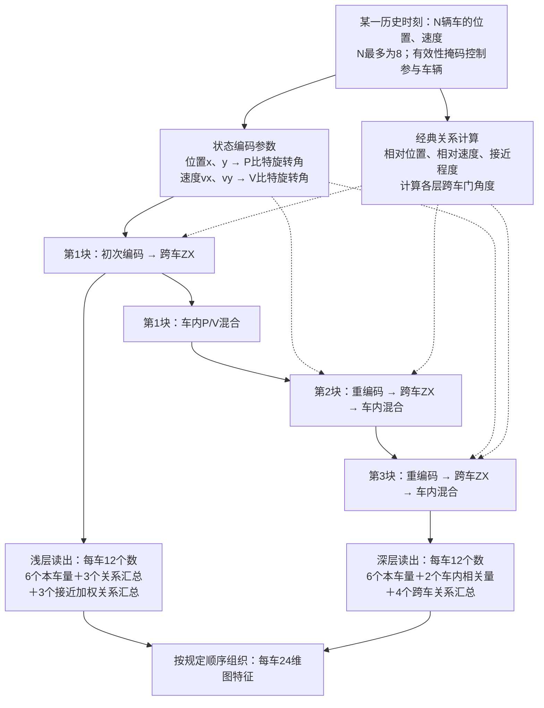
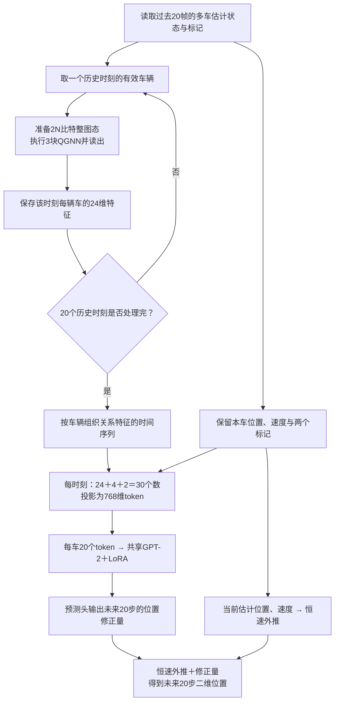

# QGNN架构与计算流程：组会讲解稿

依据：研究方案书1.4（A04），量子数学沿用A02。默认3块，PennyLane后端；实验诊断中的VP/48维不是当前主模型。

## 图1：单个时刻的QGNN内部架构

实线表示主要计算/读出路径；虚线表示经典数值控制。一个时刻只准备一份整图态，不为每辆车重复整个电路。

- 每辆车两个量子比特；N辆车共2N个，最多16个。
- 每块包含编码、跨车交互、车内混合；三块处理同一个时刻，不是三个历史时刻，也不是三个基站。
- 跨车边j→i采用Z_Pj X_Vi联合旋转。边角度由两车关系及可训练参数决定。
- 车内混合包含本车P/V间RXX和单比特旋转。P/V是初始编码通道名，多层后不只含各自原始信息。
- 浅层读出在第一块跨车ZX之后、第一块车内混合之前；深层读出在第三块全部结束后。
- 上图把浅层9个原特征和3个新增特征合称12个以便讲解；实际输出顺序为浅层9、深层12、浅层新增3。
- 默认三块共48个核心可训练标量，不是整个预测模型只有48个参数。
- 读出在仿真中计算期望值，不应理解为中途做一次破坏性测量后继续使用塌缩态。

## 图2：从历史输入到未来输出的计算流程

每个历史时刻重新准备量子态，跨时间共享模型参数；不存在把上一帧量子态直接传给下一帧的量子递归。时间依赖由后面的GPT-2处理。每辆车使用同一个时间模型，不在GPT-2内部增加跨车辆注意力。

## 可以直接讲的简短说明

每个历史时刻，我们将一辆车的位置和速度分别编码到两个量子比特，并根据车辆间的相对运动关系控制跨车量子操作。经过三块编码、交互和车内混合，结合浅层和深层读出，为每辆车得到24维图特征。随后将20个历史时刻的图特征与本车状态一起输入GPT-2，预测未来20步轨迹修正量。

## 汇报证据边界

目前数学和接口验收通过，不等于正式预测优势已成立。此前固定未训练电路的小头诊断，仅用于发现结构风险和初筛特征，不是本图完整模型的最终ADE/FDE成绩。A04主要GNN基线采用师兄完整GNN，不应再画成“同一LLM只更换图模块”的主比较。
