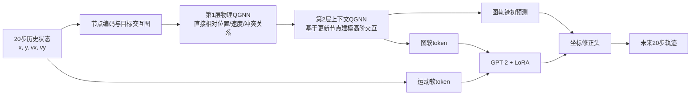

# 双层 QGNN＋LLM 最终实验结果（截至 2026-09-09）

## 1. 最终结论

本轮保留的主方案是**物理对齐的双层 QGNN＋LLM**。两层图消息传递均使用 PennyLane 量子电路，LLM 使用 GPT-2＋LoRA 完成轨迹修正。实验固定随机种子 2026，在 5、10、15、20 dB 四个 SNR 上评估。

最终测试结果支持以下结论：

1. 双层 QGNN＋LLM 相对 Plain GNN 的 ADE 降低 **3.357%**，FDE 降低 **2.694%**；2000 次逐场景配对 bootstrap 的 95% CI 均完全大于 0，说明该混合方案相对纯 GNN 的提升在当前测试场景上稳定。
2. 双层 QGNN＋LLM **没有超过参数匹配的经典双层 GNN＋LLM**：ADE 高 0.516%，FDE 高 0.790%，两项 95% CI 均跨 0。不能据此声称量子模型整体优于经典模型。
3. 在预先按交互复杂度划分的高复杂度三分位中，量子方案在四个 SNR 上均呈正向趋势：ADE 改善 0.138%–0.395%，FDE 改善 0.589%–0.690%。四 SNR 宏平均为 ADE **+0.244%**、FDE **+0.625%**，但 95% CI 仍跨 0，因此只能表述为“稳定趋势”，不能表述为显著优势。
4. 当前最稳妥的论文贡献是：提出可训练、物理对齐、参数匹配的双层 QGNN＋LLM 框架；证明它显著优于纯 GNN；通过严格经典对照和分层诊断发现量子关系核的收益集中于高交互复杂度场景。当前证据不足以证明普适的量子优势。

## 2. 主方案结构

### 2.1 为什么使用两层 QGNN

第一层处理**直接的一跳交互**：当前目标与邻居之间的相对距离、相对速度、接近趋势和冲突风险。该层将上下文相关量乘以 0.35，使物理边特征占主导。

第二层接收第一层更新后的节点表示，处理**邻居已经受其他目标影响之后的高阶交互**。例如 A 影响 B、B 又影响 C，第二层让 A 能间接感知 C 的作用。该层的上下文增益为 1.0，更重视经过第一层汇聚后的群体关系。

旧版“双层量子”失败并非说明两层结构本身无效，而是旧版把高维特征任意压到少数量子角度，且两层没有明确分工，信息瓶颈和重复变换叠加后使量子分支退化。新版通过物理特征前置、分层角色和中性残差初始化，使双层量子模型恢复到合理水平。

### 2.2 每条边如何进入量子电路

每条候选交互边形成 12 个有物理含义的关系量：

- 7 个有界物理边特征；
- 4 个分组节点相关量，用于描述发送端和接收端隐藏特征的对应关系；
- 1 个节点隐藏特征 RMS 差异。

每个通道先做可学习缩放和平移，再经

\[
\theta_k=2\arctan(s_kx_k+0.25\tanh b_k)
\]

映射到 \((-\pi,\pi)\)。`atan` 在小输入区近似线性，在大输入区自动饱和，既保留正常变化，又防止极端特征产生无限大的旋转角。

### 2.3 量子电路

- 后端：PennyLane 0.31.1 `default.qubit`；
- 模式：解析态矢量模拟，`shots=None`；
- 量子比特：6；
- 电路深度：3；
- 每个量子比特用一个 `RY` 角和一个 `RZ` 角承载两类信息，因此 12 个关系量正好映射到 6 个量子比特；
- 每层依次执行数据编码、可训练 `RZ-RY-RZ`、环形 CNOT；
- 三层均重新编码输入，即数据重上传；
- 每层量子核有 54 个可训练参数；
- 测量 6 个单比特 \(Z_i\) 与 6 个相邻双比特 \(Z_iZ_{i+1}\)，得到 12 维量子关系表示。

12 维测量结果经两个经典线性读出产生多头注意力和消息门控。量子电路负责判断“哪个邻居重要、消息通过多少”，128 维消息内容仍由经典 value 路径承载，避免用 6 个量子比特直接生成高维轨迹。

### 2.4 参数匹配经典对照

量子核的严格对照是 `12→2→12` 的低秩 SiLU MLP，每层 60 个参数；量子核每层 54 个参数。除关系核之外，两组的初始化、输入批次、训练轮数、选择规则和网络其余部分保持一致。完整图模型总参数仅相差 12 个，避免把参数量差异误当成量子收益。

### 2.5 LLM 阶段

图网络先产生节点表示和粗轨迹。历史运动信息形成运动软 token，图节点/交互表示形成图软 token；这些连续向量经投影后直接作为 GPT-2 的输入嵌入，而不是转成自然语言字符串。GPT-2＋LoRA 输出用于坐标残差修正。

最终量子 LLM 训练采用分阶段策略：先从双层 QGNN 图检查点构建 QGNN＋LLM；发现联合解冻图骨干会使量子分支退化后，保留第 4 轮检查点并冻结图骨干，只训练 token 投影、LoRA 和坐标修正头 16 轮。最终选择继续训练第 14 轮。

## 3. 最终测试结果

测试集含 1200 个场景。表中结果为四个 SNR 的宏平均，越低越好。

| 模型 | ADE (m) | FDE (m) | 相对 Plain GNN 的 ADE 改善 | 相对 Plain GNN 的 FDE 改善 |
|---|---:|---:|---:|---:|
| Plain GNN | 0.667081 | 1.287700 | 0 | 0 |
| 双层经典 GNN | 0.647470 | 1.248408 | 2.940% | 3.051% |
| 双层 QGNN | 0.650250 | 1.259475 | 2.523% | 2.192% |
| 双层经典 GNN＋LLM | **0.641379** | **1.243187** | **3.853%** | **3.457%** |
| 双层 QGNN＋LLM | 0.644688 | 1.253012 | 3.357% | 2.694% |

### 3.1 配对 bootstrap

逐场景成对重采样 2000 次，正值表示量子方案改善。

| 对比 | 指标 | 中位改善 | 95% CI | 改善概率 |
|---|---|---:|---:|---:|
| QGNN＋LLM vs Plain GNN | ADE | +3.331% | [2.559%, 4.144%] | 1.000 |
| QGNN＋LLM vs Plain GNN | FDE | +2.670% | [1.654%, 3.749%] | 1.000 |
| QGNN＋LLM vs 经典＋LLM | ADE | -0.516% | [-1.206%, 0.178%] | 0.0685 |
| QGNN＋LLM vs 经典＋LLM | FDE | -0.788% | [-1.703%, 0.101%] | 0.0400 |
| QGNN vs 经典图模型 | ADE | -0.428% | [-1.122%, 0.263%] | 0.1150 |
| QGNN vs 经典图模型 | FDE | -0.873% | [-1.789%, 0.024%] | 0.0280 |

bootstrap 衡量当前固定模型在测试场景重采样下的稳定性，不能替代多随机种子训练。

## 4. 交互复杂度分层

分层指标完全不使用预测误差。每个场景根据目标数、20 m 内近邻对数、5 s 内预测冲突对数、闭合速度和机动强度计算百分位秩，再取均值形成复杂度分数，并按三分位划分，每组 400 个测试场景。

| 复杂度 | ADE 量子改善 | ADE 95% CI | FDE 量子改善 | FDE 95% CI |
|---|---:|---:|---:|---:|
| 低 | -0.889% | [-2.165%, 0.355%] | -1.546% | [-3.318%, 0.151%] |
| 中 | -1.243% | [-2.483%, -0.026%] | -2.197% | [-3.772%, -0.648%] |
| 高 | +0.244% | [-0.945%, 1.435%] | +0.625% | [-0.829%, 2.067%] |

高复杂度组四个 SNR 的点估计均为正：

| SNR | ADE 改善 | FDE 改善 |
|---:|---:|---:|
| 5 dB | +0.395% | +0.690% |
| 10 dB | +0.217% | +0.601% |
| 15 dB | +0.201% | +0.615% |
| 20 dB | +0.138% | +0.589% |

高复杂度减低复杂度的收益差为 ADE +1.135 个百分点、FDE +2.174 个百分点；对应 95% CI 分别为 [-0.622, 2.874] 和 [-0.049, 4.390]。FDE 的方向性概率为 0.972，但按双侧 95% CI 标准仍未越过显著性门槛。

## 5. 模型复杂度与推理时间

同一 RTX 4090、同一 1200 场景×4 SNR 完整评估的墙钟时间如下。PennyLane 使用解析态矢量模拟器，因此该时间代表软件模拟开销，不代表真实量子硬件时延。

| 模型 | 总参数 | 四 SNR 评估时间 | 每场景-SNR 约耗时 |
|---|---:|---:|---:|
| Plain GNN | 400,558 | 2.679 s | 0.558 ms |
| 双层经典 GNN | 300,092 | 2.179 s | 0.454 ms |
| 双层 QGNN | 300,080 | 52.263 s | 10.888 ms |
| 双层经典 GNN＋LLM | 70,542,882 | 4.681 s | 0.975 ms |
| 双层 QGNN＋LLM | 70,542,870 | 57.387 s | 11.956 ms |

在当前 PennyLane 解析模拟下，量子图模型约为匹配经典图模型的 24.0 倍耗时；加入 LLM 后约为匹配经典＋LLM 的 12.3 倍。量子方案的优势不在参数量：两种双层图模型只差 12 个参数，两种 LLM 总模型也只差 12 个参数。

## 6. 关键消融和失败路线

### 6.1 单层、旧双层与物理对齐双层

| 开发集方案 | ADE (m) | FDE (m) | 结论 |
|---|---:|---:|---|
| 单层匹配经典 | 0.676196 | 1.308717 | 基准 |
| 单层 PennyLane QGNN | 0.676327 | 1.309241 | 与经典近乎持平，无量子优势 |
| 旧版双层经典 | 0.671646 | 1.298156 | 两层经典有效 |
| 旧版双层量子 | 0.692303 | 1.345202 | 明显退化；高维压缩和两层重复作用导致瓶颈 |
| 新版物理对齐双层经典 | 0.672841 | 1.303015 | 匹配对照 |
| 新版物理对齐双层 QGNN | 0.675118 | 1.303763 | 修复旧版崩溃，FDE 接近经典，ADE 仍稍差 |

新版双层 QGNN 相比单层 QGNN 的开发集 ADE 改善约 0.179%，FDE 改善约 0.418%，说明分层设计有帮助；它仍不足以超过匹配经典模型。

### 6.2 量子电路机制消融

早期锁定协议下的开发集图模型结果：

| 量子变体 | ADE (m) | FDE (m) | 解释 |
|---|---:|---:|---|
| 去除纠缠 | 0.753977 | 1.474782 | 最差，说明邻近量子比特耦合不可缺 |
| 仅 1 层电路 | 0.741027 | 1.437262 | 表达深度不足 |
| 去除数据重上传 | 0.744333 | 1.456635 | 重复注入数据有助于提高非线性表达 |
| 编码范围缩至 0.5π | 0.680496 | 1.315573 | 比完整范围的单层 QGNN 更差，窄角度导致区分能力下降 |

这些结果证明纠缠、三层深度和数据重上传对当前量子核有效，但“量子电路内部机制有效”不等于“量子优于匹配经典模型”。

### 6.3 其他负结果

- 将量子输出直接扩展到高维 value 消息：量子 0.677705/1.311409，经典 0.675193/1.303526，量子更差。
- 从零训练的 basis-mixing 双层方案：经典开发集已退化到 0.699142/1.362656，量子早期也无改善，停止该路线。
- 从强检查点进行 basis-mixing 热启动：量子前 3 轮未超过 epoch 0，停止。
- LLM 阶段解冻量子图骨干：第 5 轮后性能退化，说明量子关系核容易被较大的 LLM 梯度扰动；冻结图骨干后完整开发集达到 0.671203/1.299919。
- 高复杂度样本定向微调：测试量子 0.645751/1.254935，未超过主检查点 0.644688/1.253012，因此不替换主模型。
- 在开发集选择“高机动”物理规则后，测试集仅接近持平，未复现开发优势，因此不作为论文结论。
- 两跳稀疏交互的探索性图实验曾在独立开发确认块得到约 1.05% ADE、0.92% FDE 的量子改善，但它不含 LLM、没有最终测试，且不是当前双层主模型，只能作为后续研究线索。

## 7. 与早期“Graph＋LLM 提升 4%–6%”的关系

早期完整协议中，GNN＋LLM 测试 ADE/FDE 为 0.592450/1.195643，GNN 为 0.620168/1.252882，对应 4.47%/4.57% 改善。该实验使用原始完整划分和不同的图/LLM 训练协议。

本轮双层 QGNN 电路实验使用固定量子子集、四 SNR 宏平均、匹配经典关系核和新的分阶段训练。两组数字的分母、模型、划分与噪声协议不同，不能直接相减或把 4%–6% 当成本轮 classical 对照的预期提升。

## 8. 论文中可以和不可以写的结论

可以写：

> The proposed physics-aligned dual-layer QGNN-LLM reduces ADE and FDE by 3.36% and 2.69%, respectively, over the plain GNN baseline. Paired scene bootstrapping confirms positive improvements under the evaluated four-SNR protocol. A complexity-stratified analysis further reveals consistent positive point estimates in high-interaction scenes across all SNR levels.

必须紧接着说明：

> The matched classical GNN-LLM remains better in aggregate, and the quantum gains in the high-complexity stratum are not statistically conclusive under a single training seed.

不可以写“QGNN 已显著优于经典 GNN”“证明了量子优势”或“真实量子平台加速”。当前运行是 PennyLane 解析态矢量模拟，且只有一个训练种子。

## 9. 投稿前仍建议补齐

若只按当前单种子结果投稿，论文应定位为**量子增强图关系建模框架与严格诊断研究**，不要以普适量子优势为标题。为应对审稿人的主要质疑，后续最优先补：

1. 至少 3–5 个训练种子，报告跨种子均值、标准差和置信区间；
2. 把高交互复杂度条件在方法部分预注册，再用独立数据或新划分验证；
3. 在有限 shots 和噪声模型下验证稳定性，区分解析模拟与近硬件模拟；
4. 增加同参数量经典核、较宽 MLP 核和注意力核三类对照；
5. 若 ICCT 论文必须以“量子优于经典”为主张，则当前结果仍不够，应新增更高冲突密度的数据或任务，而不能只调整表述。

## 10. 复现与证据边界

- 随机种子：2026；
- 训练/选择：固定电路训练子集、256 场景选择集、991 场景完整开发集；
- 最终测试：1200 场景，四 SNR；
- 检查点选择：开发选择集 `ADE + 0.35×FDE`，未用测试误差选 epoch；
- 量子后端：PennyLane 0.31.1 `default.qubit`，解析态矢量，`shots=None`；
- GPU：NVIDIA GeForce RTX 4090；
- 统计：逐场景配对 bootstrap；
- 限制：单种子；当前所谓“官方测试划分”在项目早期阶段曾被使用，不能描述为从未查看的盲测；高复杂度分层为结果无关的物理指标，但其优势 CI 仍跨 0。

最终结果图的 panel (a) 展示四种增强方案相对 Plain GNN 的误差下降；panel (b) 展示 QGNN＋LLM 相对匹配经典＋LLM 在低、中、高复杂度场景中的改善及 95% 配对 bootstrap CI。误差条跨过 0 表示当前证据不能排除无差异。
