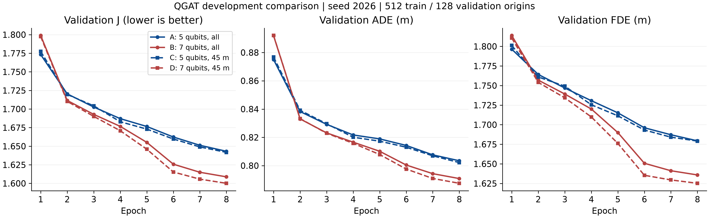

# QGAT 四组开发对照结果

四组均完成固定 8 轮训练。每组 512 个训练起点、128 个 V_select 起点，种子 2026；验证覆盖四档 SNR。
5 比特 = 3 索引 + 1 注意力 + 1 值；7 比特 = 3 索引 + 2 注意力 + 2 值。

## 同为第 8 轮的结果

| 组别 | 结构与邻居 | ADE (m) | FDE (m) | J |
|---|---|---:|---:|---:|
| A | 5 比特，全部有效车辆 | 0.803457 | 1.679399 | 1.643156 |
| B | 7 比特，全部有效车辆 | 0.790865 | 1.635852 | 1.608791 |
| C | 5 比特，45 米 | 0.802182 | 1.679109 | 1.641736 |
| D | 7 比特，45 米 | 0.787520 | 1.625193 | 1.600117 |

J = ADE + 0.5 × FDE，均为越低越好。

## 各组最佳验证轮次

| 组别 | 最佳轮次 | ADE (m) | FDE (m) | J |
|---|---:|---:|---:|---:|
| A | 8 | 0.803457 | 1.679399 | 1.643156 |
| B | 8 | 0.790865 | 1.635852 | 1.608791 |
| C | 8 | 0.802182 | 1.679109 | 1.641736 |
| D | 8 | 0.787520 | 1.625193 | 1.600117 |

## 第 8 轮因素差值

负数表示前者误差更低。

| 比较 | ADE 差 | FDE 差 | J 差 |
|---|---:|---:|---:|
| B−A：全邻居下扩展表示 | -0.012592 | -0.043546 | -0.034366 |
| D−C：45 米下扩展表示 | -0.014661 | -0.053916 | -0.041620 |
| C−A：5 比特下限制邻居 | -0.001275 | -0.000289 | -0.001420 |
| D−B：7 比特下限制邻居 | -0.003344 | -0.010659 | -0.008674 |
| D−B−C+A：交互项 | -0.002069 | -0.010370 | -0.007254 |

## 最后一轮趋势与检查

| 组别 | 第 8 轮 J − 第 7 轮 J | 最后一轮是否最佳 | 量子角更新数 |
|---|---:|---|---:|
| A | -0.008057 | 是 | 9 |
| B | -0.006156 | 是 | 18 |
| C | -0.007265 | 是 | 9 |
| D | -0.005568 | 是 | 18 |

四组时序模块初始参数完全一致，A/C 与 B/D 图初始参数分别一致；评估起点和有效目标分母一致。
所有组数值与梯度门禁通过。完整线路等价性、置换、掩码、边界、Pauli 读出及真实四维输入 Jacobian 秩检查见 graph_checks.json。
未使用 V_confirm 或测试集，未修改既有 GNN 与 A07 结果。

## 解释边界

本轮为单种子、固定短程训练的开发比较，不据此宣称统计显著或正式性能优势。
两比特扩展同时改变编码、量子参数和读出投影容量，因此差异不能单独归因于比特数。
不按速度选择或淘汰模型；最佳轮次与同轮次结果分别报告。是否充分收敛仍未建立。

完整逐 SNR、逐场景结果及执行记录：summary.json。

## 本轮判断与下一步

- 全邻居下，7 比特相对 5 比特的 J 下降 2.09%；45 米邻居下下降 2.54%。两种邻居设置与四档 SNR 的改善方向一致，支持继续验证表示扩展。
- 只限制邻居时，5 比特的 J 下降约 0.09%，7 比特下降约 0.54%；本轮表示扩展的差异比半径限制更大。
- D 的 J 相比 A 下降 2.62%，ADE 下降约 1.98%，FDE 下降约 3.23%。这只是本轮观测排序，不将 D 直接定为正式方案。
- 四组均在第 8 轮达到各自最佳值，且最后一轮仍改善。下一步应保持结构不变，对四组安排相同的更充分训练预算，再做多种子验证；不凭这 8 轮淘汰 5 比特，也不把收益归结为量子优势。

执行与保存：协调执行 472.49 秒，四组各完成 256 个优化器步。远程权威检查点保留在 /home/dell/YrM/ICCT/results/qgat_factorial/{A,B,C,D}/，本地保存代码、配置、检查报告、逐场景指标与曲线。
