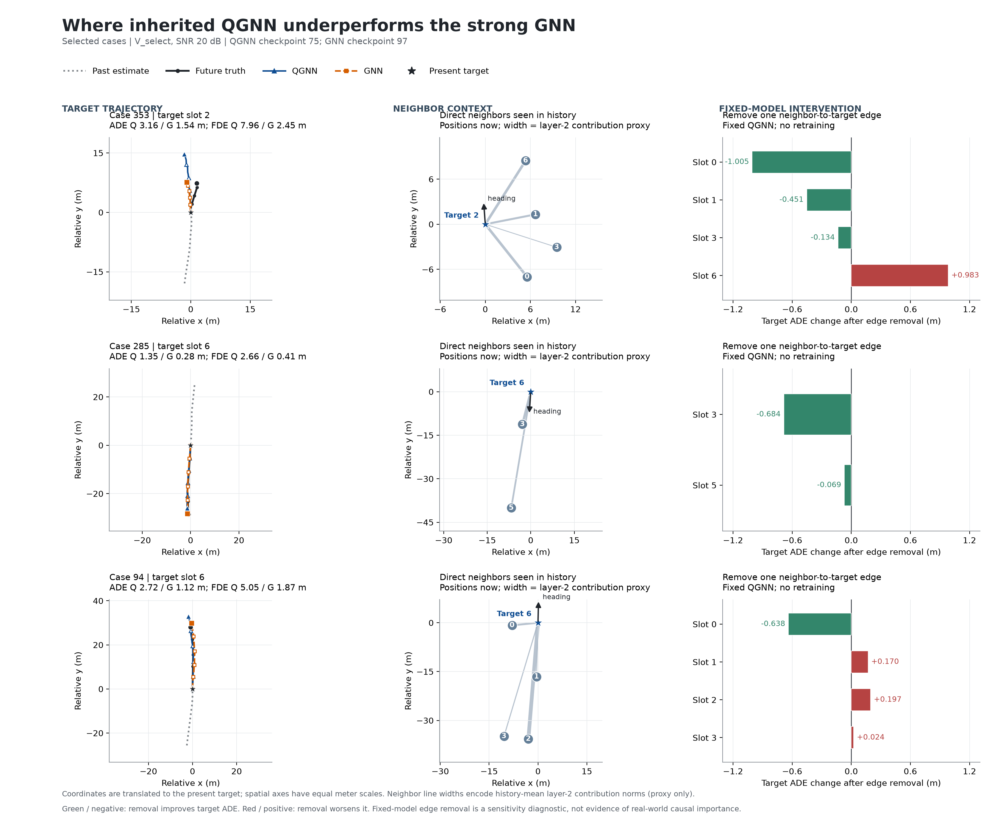
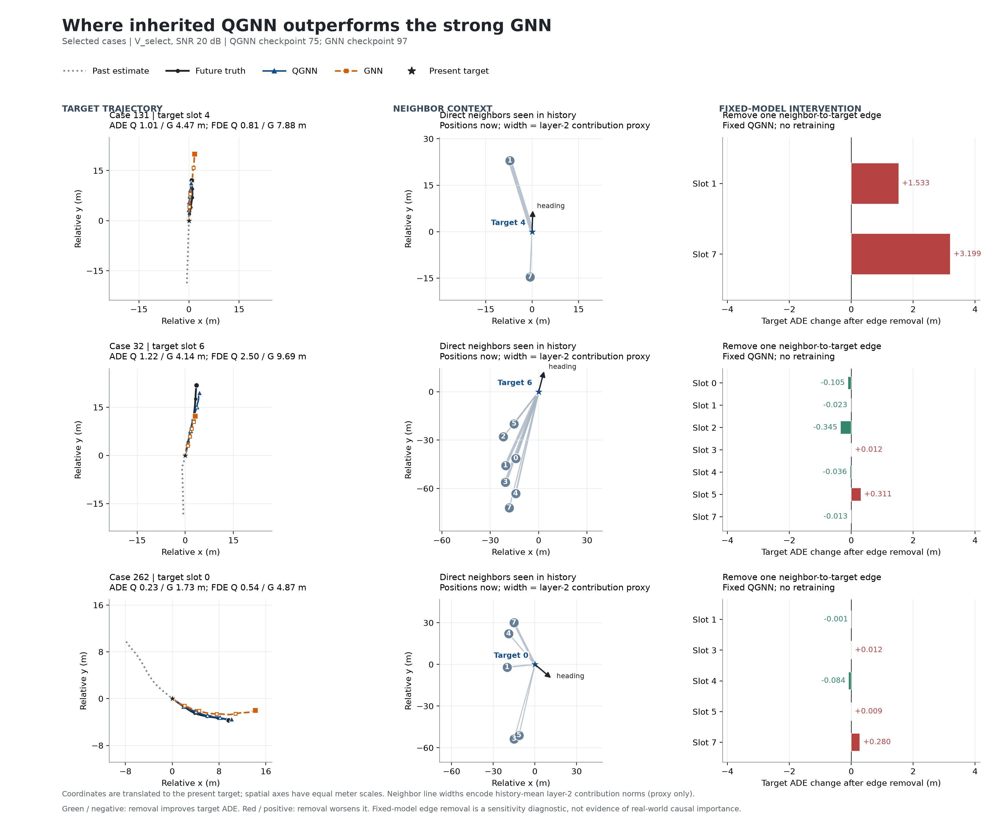

# QGNN 误差案例诊断与下一轮改动依据

2026-09-14。诊断使用已训练原 QGNN 的 best-J 第 75 轮，以及历史强 GNN 的 best-J 第 97 轮。只读取 V_select，保持检查点权重不变；全部干预均为推理检查，没有重新优化。

## 结论

保留原 QGNN，停止继续扩展 X 读出。下一轮仅检验一个零增参假设：将量子关系分支的相对位置、相对速度，转为接收车辆的行驶方向坐标，使“前后、横向、相对运动”更直接地进入电路。现有证据支持研究关系表示，但尚未证明这个坐标变换会改善预测。

强 GNN 同时从头按相同规则训练，以补齐历史 GNN 前 40 轮物理批量不同的比较缺口。原 QGNN 已完成同样的 150 轮上限、patience=20 协议；校验源码、数据、初始化和训练规则一致后复用，无需重跑。

## 整体与分组误差

以下先在每个预测起点内平均四档 SNR，再分组；正差值表示 QGNN 更差。ADE/FDE 单位为米。

| 对象 | ADE | FDE | 说明 |
|---|---:|---:|---|
| 原 QGNN，第 75 轮 | 0.542767 | 1.095422 | 同一最低 J 检查点 |
| 历史强 GNN，第 97 轮 | 0.551613 | 1.121639 | 尚有历史批量差异 |
| X 读出 QGNN，第 54 轮 | 0.546512 | 1.103938 | 比原版差 0.690% / 0.777% |

400 个起点中，原 QGNN 的 ADE/FDE 同时优于历史 GNN 的有 186 个，同时更差的有 145 个。整体均值掩盖了局部差异：

| 分组 | 起点 / 片段 | Q−G ADE | Q−G FDE | 判断 |
|---|---:|---:|---:|---|
| 最后一帧有 3–5 条现存轨迹 | 43 / 5 | +0.07107 | +0.17583 | 当前较明显短板；逐个去掉片段后差值仍为正 |
| 最近车辆对距离小于 5 m | 247 / 22 | −0.02450 | −0.06498 | 当前整体优势更明显 |
| 最近车辆对距离 5–15 m | 150 / 15 | +0.01688 | +0.04215 | 不同源块方向不一致，不能据此硬设距离阈值 |

400 个起点来自 25 个片段，每片段 16 个相邻或重叠窗口；共享源组又把它们连接为 2 个保守相关分量，不能当作 400 个独立实验。最后一帧只有 3–5 条现存轨迹的分组只覆盖一个相关分量，尚不足以宣称普遍规律。20 dB 下已有轨迹的检测标记全部为真，未分配/不存在的槽位不能称为漏检或遮挡。

详细定义、分源块结果与留一片段检查见 [stratification.json](stratification.json)。

## 不能把“门控有用”等同于“邻居选择已被证明是瓶颈”

以下控制使用原 QGNN 固定第 75 轮权重、全部 400 个 V_select 起点、20 dB；基准 ADE/FDE 为 0.542716/1.095300。

| 推理时的改动 | ADE | FDE | 相对基准退步 ADE / FDE |
|---|---:|---:|---:|
| 邻域内注意力改成均匀分配，保留门控 | 0.559418 | 1.136193 | 3.08% / 3.73% |
| 门控全部设为 1，保留注意力 | 0.635045 | 1.310495 | 17.01% / 19.65% |
| 门控改成邻居间算术均值 | 0.551861 | 1.123766 | 1.68% / 2.60% |
| 门控改成注意力加权均值 | 0.545601 | 1.102098 | 0.53% / 0.62% |

最后一项保持每个接收节点、每个头的标量总权重 Σa·g 不变，最大误差为 4.77×10⁻⁷；实现重建的注意力与实际注意力完全一致。因此，“门控全设为 1”带来的大幅退步，不能主要归因于取消邻居间差异；消息整体强度也很重要。加权均值仍会改变聚合消息的方向或范数，第一层变化还会影响第二层，故它也不是完全隔离的因果实验。

这些结果说明模型依赖已学到的关系分支，不能证明量子计算相对经典实现的必要性。详见 [case_diagnostics.json](case_diagnostics.json) 和 [weighted_gate_control.json](weighted_gate_control.json)。

## 具体车辆案例及反例

从不同片段选择 3 个较差、3 个较好案例。下表误差为选定目标车辆的 20 dB ADE/FDE；移除边是在两个图层、整个历史窗内移除指定的“邻居→目标”直接边，其余权重保持不变。负变化表示移除后改善。

| 起点 / 目标槽位 | Q ADE / FDE | G ADE / FDE | 一项有代表性的移边结果 ΔADE / ΔFDE |
|---|---:|---:|---|
| 353 / 2 | 3.160 / 7.957 | 1.541 / 2.450 | 移除邻居 0：−1.005 / −2.507；移除邻居 6：+0.983 / +2.066 |
| 285 / 6 | 1.350 / 2.663 | 0.278 / 0.407 | 移除邻居 3：−0.684 / −1.452 |
| 94 / 6 | 2.721 / 5.045 | 1.120 / 1.871 | 移除邻居 0：−0.638 / −1.121 |
| 131 / 4 | 1.005 / 0.806 | 4.466 / 7.879 | 移除后方邻居 7：+3.199 / +6.988 |
| 32 / 6 | 1.218 / 2.504 | 4.138 / 9.688 | 移除邻居 2：−0.345 / −0.771；移除邻居 5：+0.311 / +0.607 |
| 262 / 0 | 0.227 / 0.541 | 1.735 / 4.870 | 移除邻居 7：+0.280 / +0.798 |

同一案例中可以同时有改善和恶化的移边结果。起点 131 中的后方邻居是“只保留前车”规则的明确反例；不同案例里相近距离的邻居也可能有不同影响。因此，本轮不设置前后、距离或反向车辆的硬删除规则。图中线宽表示第二层历史平均贡献范数的代理量，不能读成注意力、真实因果重要性或已证明的收益。

全部六个目标都有 20 帧有效历史，不能将这些大误差解释为目标历史过短。没有车道或交互真值标签，也不能据轨迹图自行断言变道、遮挡等事件。

矢量图：[较差案例 PDF](figures/worse_cases.pdf)、[较好案例 PDF](figures/better_cases.pdf)。完整预测与图层遥测见 `predictions.npz`、`case_traces.npz`；逐目标指标见 [target_errors.csv](target_errors.csv)。

## 下一轮的单一假设和验收

电路当前接收全局横纵坐标下的相对位置、相对速度；车辆向相反方向行驶时，相同的全局符号代表不同的前后关系。新版本仅在量子分支进入 tanh 前，把这四个通道旋转到接收车辆的横向和前向坐标。距离、接近速度、TTC、上下文、经典消息、邻域和时间预测器不变。低于 1 m/s 时采用原坐标，阈值预先固定，未根据验证误差搜索。

该假设可能降低学习相对方向关系的负担，也可能没有收益；稀疏轨迹分组短板与新编码之间尚无直接因果证据。将通过完整训练回答，而不把方向解释本身作为收益。

按相同 seed、数据、批量、优化器和选模规则比较方向编码 QGNN、原 QGNN，以及从头训练的强 GNN；从同一 best-J 检查点分别报告 ADE、FDE。如果只能改善一个指标，明确记为混合结果；如果达到上限仍在改善，先检查训练充分性。只有开发结果支持继续，才考虑多种子和独立确认。协议见 [方向编码试跑协议](../qgnn_motionframe/PROTOCOL.md)。
